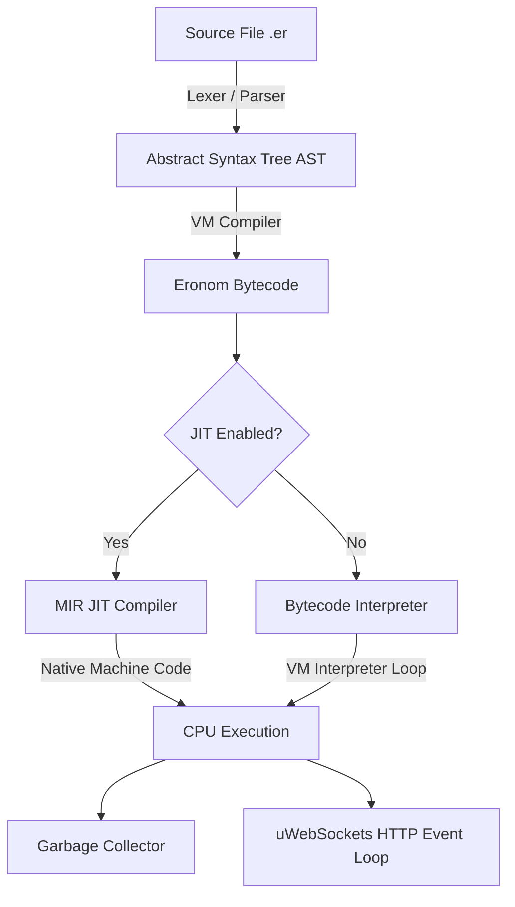

# Eronom ⚡

Eronom is a high-performance, JIT-compiled scripting language runtime and virtual machine written in Rust. It features a custom interpreter, an on-the-fly JIT compiler built on Vladimir Makarov's MIR JIT compiler, and an ultra-fast HTTP networking layer powered by native C++ `uWebSockets`.

Designed for building light and blazing-fast web services, Eronom supports dynamic hot-reloading: it can detect file modifications on-the-fly and reload routing/VM logic instantly *without* dropping active TCP connections or restarting the process.

---

## 🚀 Key Features

* **High Performance**: Outperforms Node.js and Bun, matching the throughput and latency of Deno.
* **Hybrid Execution Engine**:
  * **Bytecode Interpreter**: Standard VM executing custom Eronom bytecode.
  * **JIT Compiler**: Compile bytecode directly to native machine code on-the-fly via the integrated **MIR JIT compiler** (C backend).
* **Native C++ Networking**: Integrates **uWebSockets** and **uSockets** via custom FFI bindings for maximum performance.
* **Dynamic Hot-Reloading**: Automatically detects source code changes (in the main script or `config.er`) and re-evaluates the VM script state without dropping network socket connections.
* **Modern Syntax**:
  * Variable declarations with optional types (`let name : string = "value"`) or constants (`const age = 7`).
  * String interpolation: `"Hello {name}"`.
  * Arrow functions / closures: `(c) => { return c.json(todos) }`.
  * Dynamic arrays, objects, and bracket-assign/access (`arr[0] = val`, `obj.key = val`).
  * Range-based loops (`for i in 1..1000`).
* **Automated GC**: Custom Garbage Collector managing allocations for VM values (Objects, Arrays, Strings).

---

## 🏗️ Architecture

The compilation and execution workflow of Eronom is structured as follows:



---

## 📁 Repository Structure

* **`src/frontend/`**: The language parsing frontend.
  * `lexer.rs`: Tokenizes Eronom source strings.
  * `parser.rs`: Recursive descent parser converting tokens into AST nodes.
  * `ast.rs`: AST nodes representing statements, variables, conditions, loops, and functions.
  * `token.rs`: Token types for Eronom grammar.
* **`src/vm/`**: Bytecode compiler, VM execution, and core runtimes.
  * `compiler.rs`: Compiles the AST into VM bytecode.
  * `execute.rs`: Evaluates bytecode inside the VM stack loop.
  * `gc.rs`: Mark-and-sweep style Garbage Collector.
  * `value.rs`: Representation of runtime values (numbers, strings, booleans, objects, arrays).
  * `er_http.rs` & `er_http.cpp`: Rust FFI and C++ wrappers bridging Eronom callbacks with uWebSockets.
* **`src/jit/`**: Just-In-Time compiler.
  * `compiler.rs`: Generates MIR intermediate representation from Eronom bytecode.
  * `bindings.rs` & `helpers.rs`: Rust interfaces to the C-based MIR engine.
* **`external/`**: Submodules for dependencies:
  * `mir`: Vladimir Makarov's lightweight JIT compiler.
  * `uWebSockets`: The high-performance C++ uWebSockets & uSockets library.
* **`example-er/`**: Reference scripts, benchmark configurations, and comparable API server implementations.

---

## 📝 Syntax Examples

### 1. Variables and Print
```rust
let name : string = "Vishnu"
const age = 7

print("Hello {name}! You are {age} years old.")
```

### 2. Loops and Conditions
```rust
let sum = 0

for i in 1..1000 {
    if (i + i > 500) {
        sum = sum + i
    }
}
print("Sum is: {sum}")
```

### 3. HTTP Server
```javascript
let app = route()
let todos = [
  { id: 1, text: "Learn Eronom", done: false }
]

// GET all todos
app.get('/todos', (c) => {
  return c.json(todos)
})
```

---

## ⚡ Performance Benchmarks

An identical `/todos` endpoint returning a JSON array was benchmarked using `autocannon` (100 concurrent connections, 5 seconds duration) across multiple runtimes.

| Server / Runtime | Port | Core HTTP Engine | Req/Sec (Avg) | Latency (Avg) | Total Requests (5s) | Avg Bytes/Sec |
| :--- | :---: | :--- | :---: | :---: | :---: | :---: |
| **Deno** | `3003` | Hyper (Rust) | **29,630.4** | **2.86 ms** | **148k** | **6.22 MB** |
| **Eronom** | `3000` | uWebSockets (C++) | **28,324.8** | **3.06 ms** | **142k** | **5.95 MB** |
| **Bun** | `3002` | Native (C++) | **27,390.4** | **3.18 ms** | **137k** | **5.50 MB** |
| **Node.js** | `3001` | http parser (C++) | **20,372.0** | **4.44 ms** | **102k** | **5.15 MB** |

*Eronom handles connections using uWebSockets, performing similarly to Deno and Bun, with the added advantage of instant VM route reloading on source files change without dropping active connection requests.*

---

## 🛠️ Getting Started

### Prerequisites

You need standard build tools, `git` (to fetch submodules), and Rust installed on your machine.

1. Clone the repository and fetch the submodules:
   ```bash
   git submodule update --init --recursive
   ```
2. Build the project:
   ```bash
   cargo build --release
   ```

### Running Eronom Scripts

You can execute any `.er` script directly:
```bash
cargo run --release -- path/to/script.er
```

To run the included HTTP API example:
```bash
cargo run --release -- example-er/my-api/server.er
```
The server will start on port `3000` (or as configured in `example-er/my-api/config.er`). You can edit `server.er` at any time, and the runtime will automatically reload the code on the next HTTP request!
