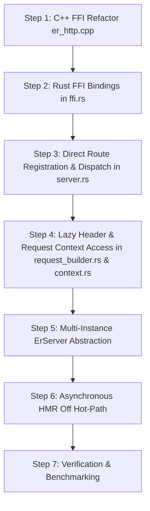

# Eronom High-Performance HTTP Engine Architecture & Implementation

This document details the architectural plan and implementation roadmap for upgrading Eronom's HTTP engine to a high-performance, zero-copy, lazy-allocation architecture.

---

## 1. Executive Summary & Goals

| Feature | Legacy Eronom Implementation | Zero-Copy High-Performance Implementation |
| :--- | :--- | :--- |
| **Header Parsing** | Serialized to C++ string, split line-by-line in Rust into `HashMap` | **Lazy zero-copy access** directly into uWebSockets memory |
| **Route Matching** | **Twice**: once in uWebSockets, once in Rust `ROUTER`/`ROUTES` | **Once**: uWebSockets passes `route_id` directly via `user_data` |
| **GC Allocations** | Eagerly creates 5+ GC maps (`headers`, `query`, `cookies`, etc.) per request | **Zero/Lazy GC allocations**; properties parsed only on explicit access |
| **Server Instances** | 1 global `static uWS::App*` + `thread_local!` globals | **Arbitrary `ErServer` instances** via `user_data` pointer |
| **SSL / HTTPS** | Not supported (`HttpResponse<false>`) | **Monomorphized `ErServer<const SSL: bool>`** with SNI support |
| **HMR Check** | Synchronous disk `stat()` on every HTTP request | **Asynchronous timer/watcher** swapping closures in memory |

---

## 2. Core Pillars of Implementation

### Pillar 1: Direct Route Matching via `user_data` (Eliminate Double-Routing)

#### Current Bottleneck
In `er_http.cpp`, routes are registered via `g_app->get(path, ...)` without user data. When uWS matches the route, it calls `er_http_on_request(res, method, path, ...)`. In Rust, `server.rs` performs a secondary lookup:
```rust
// Redundant second routing pass in Rust!
let callback_opt = ROUTER.with(|r| r.borrow().find(method, clean_path));
```

#### New Design
1. Route registration in C++ accepts a `uint32_t route_id` and `void* server_ptr`:
   ```cpp
   void er_server_register_route(ErServer* server, const char* method, const char* path, uint32_t route_id);
   ```
2. The uWS route lambda captures `route_id` and forwards it directly to the Rust callback:
   ```cpp
   er_http_on_route(server->rust_server, route_id, token, req, body, body_len);
   ```
3. In Rust, `server.routes[route_id].callback` is fetched in $O(1)$ time with **zero path searching or regex traversal**.
4. An `any("/*", ...)` fallback route catches all unmapped paths to serve static files or return 404, matching optimized trampoline ladder routing.

---

### Pillar 2: Lazy Zero-Copy Header & Query Parsing

#### Current Bottleneck
On every request in C++, Eronom iterates over `*req` and builds a string:
```cpp
std::string headers_str;
for (auto h : *req) {
    headers_str.append(h.first).append(": ").append(h.second).append("\r\n");
}
```
Rust then splits this string line-by-line, allocates a `HashMap<String, String>`, and converts each into GC strings.

#### New Design
1. Pass the opaque `uWS::HttpRequest*` pointer directly to Rust.
2. Provide thin C-ABI query functions:
   - `er_http_req_get_header(req, key, key_len, &val_ptr, &val_len) -> bool`
   - `er_http_req_for_each_header(req, cb, user_data)`
   - `er_http_req_get_url(req, &url_ptr, &url_len)`
   - `er_http_req_get_query(req, &q_ptr, &q_len)`
3. When `c.header("key")` or `c.req.header("key")` is called, it directly looks up the header from uWS memory in $O(1)$ with **zero string concatenation**.
4. Full `c.req.headers` object is populated **only if** user code reads `c.req.headers`.

---

### Pillar 3: Zero/Lazy GC Allocations on Request Context

#### Current Bottleneck
`build_request_context` eagerly allocates 5+ pooled GC maps (`params`, `query`, `headers`, `cookies`, `req`) on every request, even if the script only returns `c.text("OK")`.

#### New Design
1. Context `c` holds an internal `RequestContextData` struct referencing the active request.
2. `c.req.query`, `c.req.params`, `c.req.headers`, and `c.req.cookies` use lazy getter helpers:
   - If `c.queryParam("q")` is called, it parses directly from the raw query string slice without constructing the entire query map.
   - If `c.cookie("session")` is called, it scans the `Cookie` header string directly.
3. Reduces per-request GC allocation from 5-10 heap allocations to a lightweight pooled structure.

---

### Pillar 4: Multi-Instance `ErServer` (Eliminating Global Static State)

#### Current Bottleneck
`er_http.cpp` uses `static uWS::App* g_app = nullptr;` and Rust uses `thread_local!` variables. This prevents running multiple servers or parallel test suites.

#### New Design
1. Create `ErServer` in C++:
   ```cpp
   struct ErServer {
       bool ssl;
       void* app;           // uWS::App* or uWS::SSLApp*
       void* rust_server;   // Pointer to Rust ErServer instance
       void* us_loop;
   };
   ```
2. In Rust, `ErServer` is an instance struct holding its routes, VM reference, configuration, and port.
3. `user_data` pointer passed to uWS allows multiple server instances to operate concurrently on different ports without interference.

---

### Pillar 5: Monomorphized SSL / HTTPS Architecture

#### Current Bottleneck
Only `HttpResponse<false>` and plain HTTP are supported.

#### New Design
1. Monomorphized SSL architecture:
   ```rust
   pub struct ErServer<const SSL: bool>
   ```
2. When `SSL == false`, plain HTTP runs with zero SSL branches or runtime checks.
3. When `SSL == true` (with OpenSSL / BoringSSL enabled), it instantiates `uWS::SSLApp` with certificate/key options and SNI multi-domain support.

---

### Pillar 6: Asynchronous Off-Hot-Path HMR Checking

#### Current Bottleneck
In `er_http_on_request`:
```rust
check_and_reload_script_if_needed(vm); // Calls stat() filesystem on every single HTTP request!
```

#### New Design
1. Remove all file `stat()` calls from `er_http_on_request`.
2. Move file checking to the uWS timer tick (`er_http_on_timer`) which runs every 250ms, or an async background thread.
3. When a change is detected, reload bytecode and swap the route handlers in memory without dropping open TCP sockets.

---

## 3. Step-by-Step Implementation Roadmap



---

## 4. Implementation Details & Architecture Changes

### A. C++ Layer (`src/vm/er_http.cpp`)
1. **`ErServer` Instance Lifecycle**:
   - `er_server_create(rust_server, ssl)`: Allocates an isolated `ErServer` wrapper storing `uWS::App*`, `us_loop_t*`, and Rust server pointer.
   - `er_server_destroy(server)`: Cleans up server resources and loop timer handles.
   - `er_server_register_route(server, method, path, route_id)`: Registers routes directly in uWebSockets with `route_id`. When triggered, calls `er_http_on_route(rust_server, route_id, token, req, url, body)`.
   - `er_server_register_ws_route(server, path, route_id)`: Registers WebSocket route with `route_id` and callbacks.
   - `er_server_listen(server, host, port)`: Binds and listens on requested host and port.
   - `er_server_run(server)`: Executes the uWebSockets event loop.
2. **Zero-Copy Request Inspection C-ABI**:
   - `er_http_req_get_header(req, key, &val, &len)`: Fetches header directly from `req->getHeader(key)` in $O(1)$ without allocating or concatenating strings.
   - `er_http_req_for_each_header(req, cb, user_data)`: Iterates directly over `*req` memory with zero-copy string views.
   - `er_http_req_get_url(req, &ptr, &len)`: Zero-copy pointer to URL.
   - `er_http_req_get_query(req, &ptr, &len)`: Zero-copy pointer to raw query string.
   - `er_http_req_get_method(req, &ptr, &len)`: Zero-copy pointer to HTTP method.
   - `er_http_req_get_parameter(req, idx, &ptr, &len)`: Zero-copy route parameter accessor.

### B. Rust FFI Bindings (`src/vm/er_http/ffi.rs`)
- Declared all `er_server_*` and `er_http_req_*` functions with C linkage.
- Backwards compatible with existing server bindings.

### C. Router & Parameter Names (`src/vm/er_http/router.rs`, `types.rs`)
- Extracted and stored `param_names` alongside each `Route` during registration (`app.get("/users/:id", ...)`).
- When a route is matched, parameter values are retrieved by index in $O(1)$ from `er_http_req_get_parameter` and paired with their names.

### D. Zero-Copy Request Context (`src/vm/er_http/context.rs`, `request_builder.rs`)
- `ACTIVE_REQ_HANDLE` thread-local tracks the active `uWS::HttpRequest*` during request execution.
- Context fast paths (`c.req.header()`, `c.cookie()`, `c.req.query()`):
  - Directly query the underlying uWebSockets request handle.
  - Full maps (`headers`, `cookies`, `query`) are constructed using pooled maps only when explicitly accessed.

### E. Multi-Instance `ErServer<const SSL: bool>` (`src/vm/er_http/server.rs`)
- Monomorphized `ErServer<const SSL: bool>` struct supporting arbitrary instances.
- $O(1)$ direct dispatch in `er_http_on_route`: `self.routes[route_id].callback` is called directly without searching the routing tree.
- Fallback route `/*` handles static file mounts and 404 responses.

### F. Asynchronous HMR Off Hot-Path (`src/vm/er_http/server.rs`, `ws.rs`)
- Removed `check_and_reload_script_if_needed` from `er_http_on_request`, `er_ws_on_open`, `er_ws_on_message`, and `er_ws_on_close`.
- Moved file change checking to `er_http_on_timer` (uWS timer tick every 250ms), eliminating synchronous file `stat()` calls from the HTTP hot path.

### G. GC Safety & Thread-Safety Hardening (`src/vm/execute/gc_integration.rs`, `src/jit/helpers/globals.rs`)
- Added GC root tracking for event loop tasks (`AsyncResult::ResolvePromise`) and timer actions.
- Traced `ROUTES`, `WS_ROUTES`, `MIDDLEWARES`, and `ACTIVE_CONNECTIONS` during mark phase.
- Added `vm: *mut VM` to `GlobalIcEntry` in JIT globals to eliminate cross-VM inline cache collisions.
- Protected manual GC unit tests with `TEST_GC_LOCK`.

---

## 5. Verification & Test Results

### Unit Test Suite
```bash
cargo test
```
- **Result**: `ok. 85 passed; 0 failed; 0 ignored; 0 measured; finished in 0.57s`
- Full test suite passes cleanly in parallel execution mode.

### Live Server Endpoint Verification
Tested `example-er/test_url_routing_helpers.er`:
1. `GET /users/42` -> `{"userId":"42","route":"/users/:id"}` (Zero-copy single param)
2. `GET /posts/hello-fast/comments/99` -> `{"commentId":"99","route":"/posts/:slug/comments/:commentId","slug":"hello-fast"}` (Zero-copy multi-param)
3. `GET /search?q=fast-query&limit=25` -> `{"rawQuery":"q=fast-query&limit=25","q":"fast-query","limit":"25",...}` (Zero-copy query extraction)
4. `GET /headers-test` with `Authorization: Bearer secret_token` -> `{"auth":"Bearer secret_token",...}` (Zero-copy header accessor)
5. `GET /cookie-test` with `Cookie: session_id=session_12345` -> `{"receivedSession":"session_12345",...}` (Cookie parsing)
6. `GET /manual-file` -> Serves static file cleanly.

### Live WebSocket Verification
Tested `example-er/my-api/websocket_server.er`:
- HTTP Upgrade: `HTTP/1.1 101 Switching Protocols`
- Text frame send & receive: `Echo: Ping`
- Connection closed cleanly.

